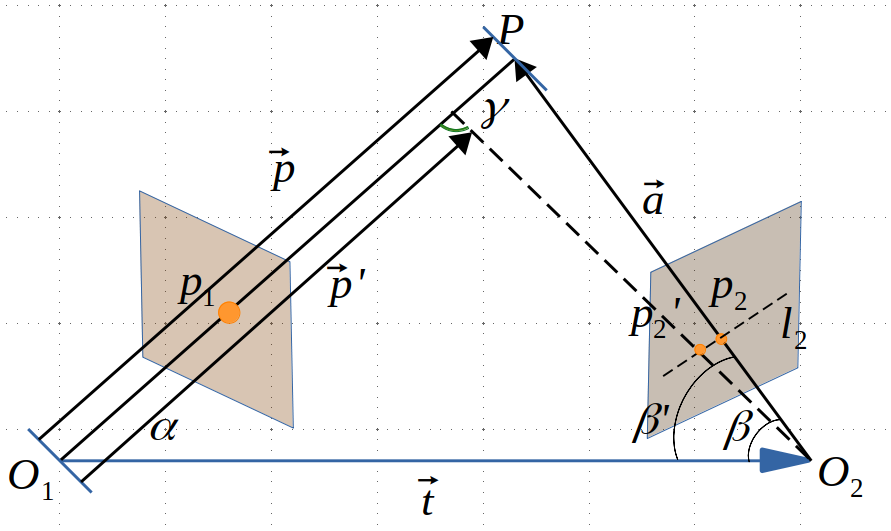

# <center>DenseMapping</center>

使用REMODE数据集进行单目相机的稠密建图。该项目会涉及以下技术

- 极线搜索和NCC块匹配技术
- 建立几何不确定性模型
- 基于高斯分布的深度滤波技术

## 1. 数据集格式解析

```shell
test_data
├── depthmaps                            # 图片深度信息文件夹
│   ├── scene_000.depth
│   ├── scene_001.depth
│   ├── scene_002.depth
│   ├── ...............
│   ├── scene_198.depth
│   ├── scene_199.depth
│   └── scene_200.depth
├── images_pose.txt                      # 存有所有图片的位姿信息
├── images                               # 图片文件夹
│   ├── scene_000.png
│   ├── scene_001.png
│   ├── scene_002.png
│   ├── .............
│   ├── scene_198.png
│   ├── scene_199.png
│   └── scene_200.png
└── README
```

- 首先，感谢UZH开源的[REMODE数据集](https://download.ifi.uzh.ch/rpg/web/datasets/remode_test_data.zip)
- 在此项目中我将`first_200_frames_traj_over_table_input_sequence.txt`重命名为`images_pose.txt`

## 2. 极线搜索和块匹配技术

<div align="center">

<p>图2.1 对极几何</p>
</div>

### 2.1 极线搜索法
$$
E = [t]_{×}R
$$

$$
F = K^{-T}EK^{-1}
$$

$$
l'=FX = [a', b', c']^T
$$

$$
l'X'= 0
$$
- $E$ 本质矩阵
- $F$ 基础矩阵
- $R$ 第二帧相机坐标系向第一帧相机坐标系的旋转矩阵
- $t$ 第二帧相机坐标系向第一帧相机坐标系的平移向量在第二帧中的坐标
- $[t]_{×}$ 平移向量的逆对称矩阵
- $l'$ 极线防方程的权重参数
- $X$ 第一帧像素坐标系中的其次坐标$[x, y, 1]$
- $X'$第二帧像素坐标系中的其次坐标$[x' y' 1]$

### 2.2 块匹配技术
- 与光流法和直接法不同，以像素块的灰度不变性作为假设
- 采用SVC，SSD或NCC作为评价像素块相似程度的指标（也可采用去均值的NCC，SVC，或SSD）
- SVC，SSD的值越小，相似度越高，NCC值越大，相似度越高
- 在极线上进行分块搜索，获取最优的像素深度的预测值（获取沿极线分布的评价相似性得分）

$$
S(A, B)_{SAD} = \sum_{i,j}|A(i, j) - B(i, j)|
$$

$$
S(A, B)_{SSD} = \sum_{i, j}(A(i, j) - B(i, j))^2
$$

$$
S(A, B)_{NCC} = \frac{\sum_{i, j}A(i, j)B(i,j)}{\sqrt{\sum_{i, j}A(i, j) ^ 2 \sum_{i, j}B(i, j) ^ 2}}
$$

## 3. 几何不确定性模型

<div align="center">

</div>

$$
\vec{a} = \vec{p} - \vec{t}
$$

$$
\alpha = \arccos<\vec{p}, \vec{t}>
$$

$$
\beta' = \arccos<O_2p_2', -\vec{t}>
$$

$$
\gamma = \pi - \alpha - \beta'
$$

$$
||\vec{p'}|| = ||\vec{t}|| \frac{\sin\beta'}{\sin\gamma}
$$

$$
\sigma_{obs} = ||\vec{p}|| - ||\vec{p'}||
$$

## 4. 基于高斯分布的深度滤波器


