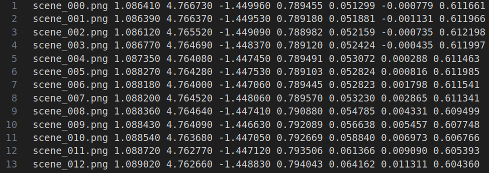
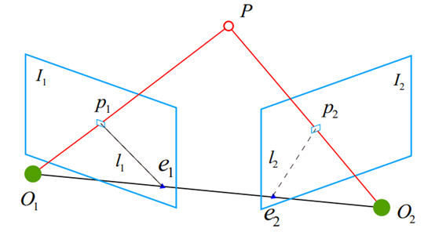
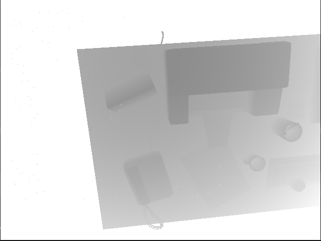
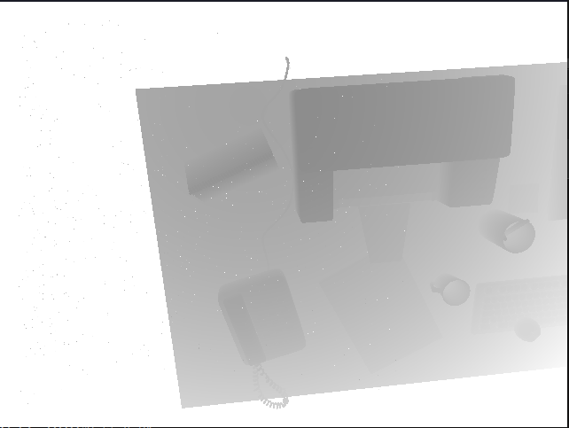

# <center>DenseMapping</center> 

Dense mapping using monocular camera with REMODE dataset. This project will involve the following technologies:

- Vanishing point search and NCC block matching techniques
- Building geometric uncertainty models  
- Depth filtering based on Gaussian distributions
- Triangulation 

The technical roadmap of the project is as follows:

<div align="center">

</div>

## 1. Dataset Format Analysis

```shell
test_data
├── depthmaps                            # Depth image folder
│   ├── scene_000.depth 
│   ├── scene_001.depth
│   ├── scene_002.depth
│   ├── ...............
│   ├── scene_198.depth
│   ├── scene_199.depth
│   └── scene_200.depth
├── images_pose.txt                      # Pose info for all images  
├── images                               # Image folder
│   ├── scene_000.png
│   ├── scene_001.png
│   ├── scene_002.png
│   ├── .............
│   ├── scene_198.png
│   ├── scene_199.png
│   └── scene_200.png
└── README
```

<div align="center">
    
</div>

- First, thank UZH for open-sourcing the [REMODE dataset](https://download.ifi.uzh.ch/rpg/web/datasets/remode_test_data.zip)
- In this project, I renamed `first_200_frames_traj_over_table_input_sequence.txt` to `images_pose.txt`  
- Each line in `images_pose.txt` contains `image_name tx ty tz qx qy qz qw`
- `images_pose.txt` stores the camera center pose in world coordinates, with `tx ty tz` in meters
- `depthmaps` stores the depth info for corresponding images, in cm
- So note unit unification is needed when triangulating

## 2. Vanishing Point Search and Block Matching

<div align="center">

</div>

### 2.1 Vanishing Point Search
$$
E = [t]_{×}R
$$

$$
F = K^{-T}EK^{-1} 
$$

$$
l'=FX = [a', b', c']^T
$$

$$
l'X'= 0
$$
- $E$: Essential matrix
- $F$: Fundamental matrix 
- $R$: Rotation from frame 2 to frame 1
- $t$: Translation from frame 2 to frame 1, in coordinates of frame 2
- $[t]_{×}$: Skew symmetric matrix of translation vector
- $l'$: Parameters of epipolar line equation
- $X$: Homogeneous coordinates in image 1 $[x, y, 1]^T$
- $X'$: Homogeneous coordinates in image 2 $[x', y', 1]^T$

### 2.2 Block Matching
- Unlike optical flow and direct methods, it assumes gray value invariance of patches
- Use SVC, SSD or NCC to evaluate patch similarity (mean-removed versions also work) 
- Lower SVC, SSD indicates higher similarity, higher NCC means higher similarity
- Search matches along epipolar lines, find best depth estimate (get similarity scores along epipolar line)

$$
S(A, B)_{SAD} = \sum_{i,j}|A(i, j) - B(i, j)|
$$

$$
S(A, B)_{SSD} = \sum_{i, j}(A(i, j) - B(i, j))^2
$$

$$
S(A, B)_{NCC} = \frac{\sum_{i, j}A(i, j)B(i,j)}{\sqrt{\sum_{i, j}A(i, j) ^ 2 \sum_{i, j}B(i, j) ^ 2}}
$$

## 3. Geometric Uncertainty Model

<div align="center">

</div>

$$
\alpha = \arccos<\vec{p}, \vec{t}> 
$$

$$
\beta' = \arccos<O_2p_2', -\vec{t}>
$$

$$
\gamma = \pi - \alpha - \beta'
$$

$$
||\vec{p'}|| = ||\vec{t}|| \frac{\sin\beta'}{\sin\gamma}
$$ 

$$
\sigma_{obs} = ||\vec{p}|| - ||\vec{p'}||
$$

- Vector $O_2p_2$ has same direction as normalized vector $O_2P_2$ in camera coordinates
- Can use $O_2P_2$ instead of $O_2p_2$ to compute $\beta'$
- Note vectors should be represented in world coordinates

## 4. Depth Filtering Based on Gaussian Distributions 

Prediction and observation equations for Gaussian depth filter:

$$
d_k = d_{k-1} +w_{k-1}
$$

$$ 
d_{k} = f(p_1, p_2, \vec{t}) + v_{k}
$$
- $w$: process noise ~ $N(0, \sigma)$
- $v$: observation noise ~ $N(0, \sigma_{obs})$  
- $p_1$: reference point
- $p_2$: reprojected point
- $\vec{t}$: pose translation from camera 1 to camera 2

Fusing prediction and observation gives optimal posterior estimate:

$$
\hat d_{k} = \frac{\sigma_{obs}^2 d_{k-1} + \sigma ^2 f(p_1, p_2, \vec{t})}{\sigma_{obs}^2 +\sigma ^2}
$$

$$
\sigma_{fuse} = \frac{\sigma^2 \sigma_{obs}^2}{\sigma^2 + \sigma_{obs}^2} 
$$


## 5. Dependency 

- [Eigen 3.4 Installation](https://gitlab.com/libeigen/eigen/-/releases/3.4.0)
- [OpenCV 4.7.0 Installation](https://github.com/opencv/opencv/tree/4.7.0)
- [Sophus 1.22.10 Installation](https://github.com/strasdat/Sophus/releases/tag/1.22.10) 
- [PCL 1.13 Installation](https://github.com/PointCloudLibrary/pcl/releases/tag/pcl-1.13.1)


## 6. Project Structure
```shell
DenseMapping
├── CMakeLists.txt
├── figures
│   ├── cpp_class_desc.png
│   ├── disturbance_analysis.png 
│   ├── flow_chart.png
│   ├── polarSearch.png
│   ├── pose_data.png
│   ├── result_iter0.png
│   ├── result_iter1.png
│   ├── result_iter2.png
│   └── scene_000.png
├── include
│   ├── block_match.h                    # Header for BlockMatch
│   ├── config.h                         # Project config
│   ├── depth_filter.h                   # Header for DepthFilter
│   ├── polar_search.h                   # Header for PolarSearch
│   ├── read_dataset_files.h             # Header for ReadDatasetFiles
│   └── triangulation.h                  # Header for Triangulation
├── LICENSE
├── README.md
└── src
    ├── block_match.cpp                  # Source for BlockMatch
    ├── depth_filter.cpp                 # Source for DepthFilter
    ├── main.cpp  
    ├── polar_search.cpp                 # Source for PolarSearch
    ├── read_dataset_files.cpp           # Source for ReadDatasetFiles
    └── triangulation.cpp                # Source for Triangulation
```

<div align="center">
 
</div>


## 7. Build and Run
```shell
mkdir build && mkdir result
cd build 
cmake ..
cmake --build . --target dense_mapping
cd bin
./dense_mapping your_test_data_path 
pcl_viewer ../../result/iter_0_result.pcd -ps 2.0
```

## 8. Results
<table cellspacing="10" cellpadding="0" style="width: 100%; table-layout: fixed;">
  <tr>
    <td style="width: 25%;"></td>
    <td style="width: 25%;"></td>
  </tr>
  <tr>
    <td style="width: 25%;"></td>
    <td style="width: 25%;"></td>
  </tr>
  <tr>
    <td style="width: 25%;"></td>
    <td style="width: 25%;"></td>
  </tr>
</table>

## 9. Areas for Improvement

- Block matching does not consider affine distortion from camera rotation
- Depth does not strictly follow Gaussian distributions, needs more complex assumptions
- Can assume inverse depth follows Gaussian, based on simulated inverse depth 
- Adjacent pixel depths cannot vary too much
- No explicit handling of mismatches
- Efficiency issues, no parallelization 

## 10. Limitations of Monocular Dense Mapping

- Accuracy of block matching depends on angle between epipolar lines and image gradients, smaller angle means fewer mismatches