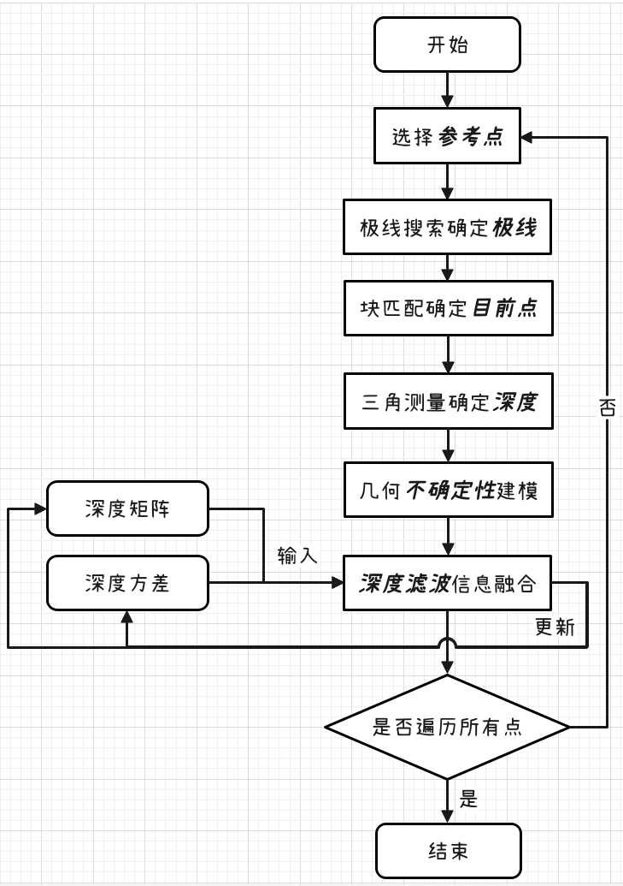
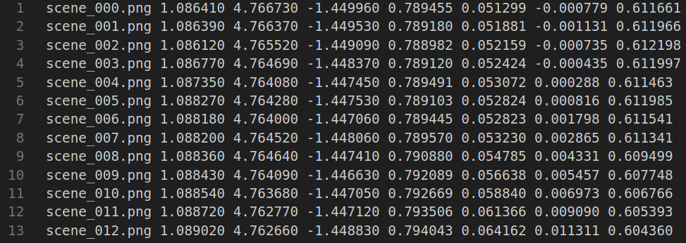
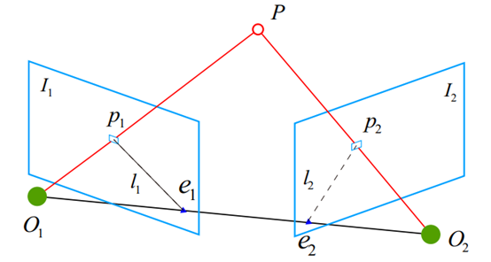
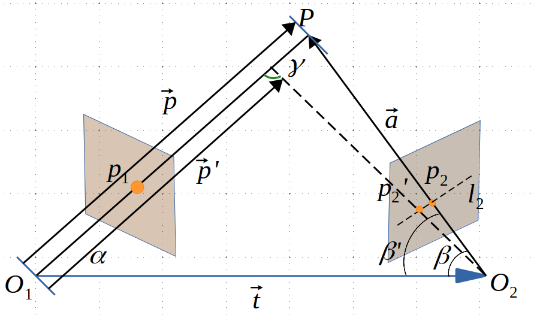
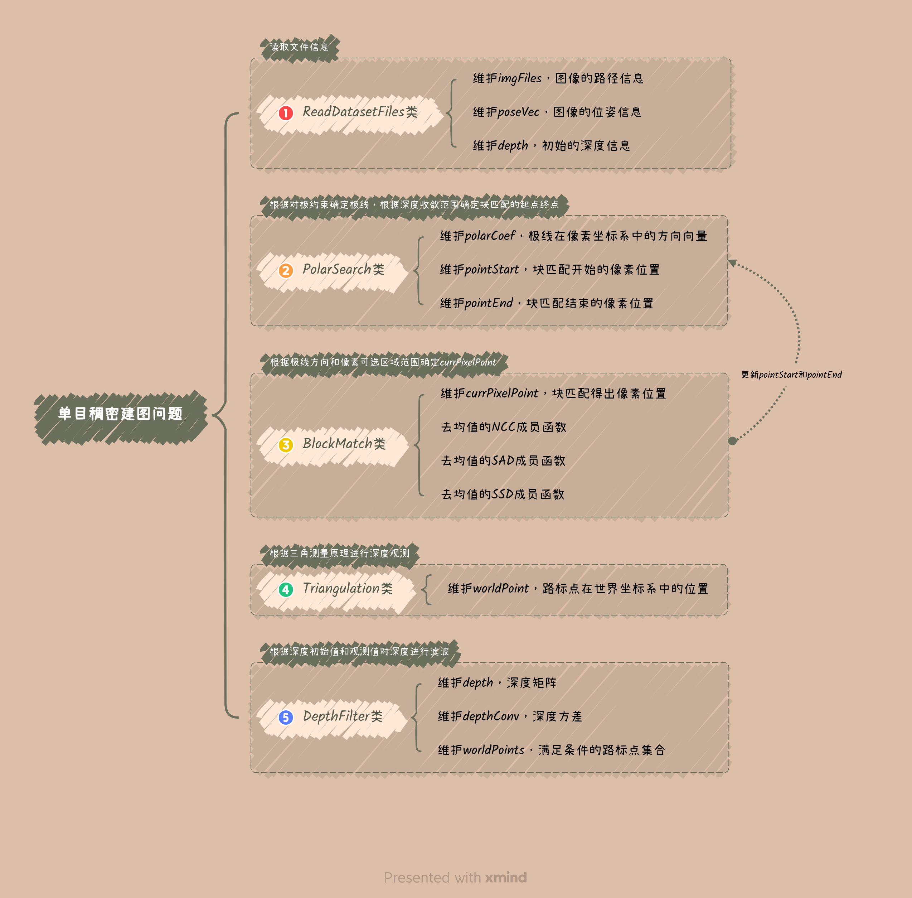
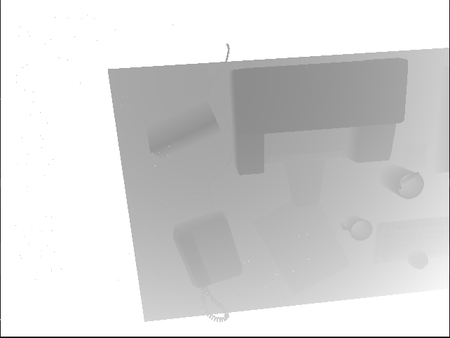
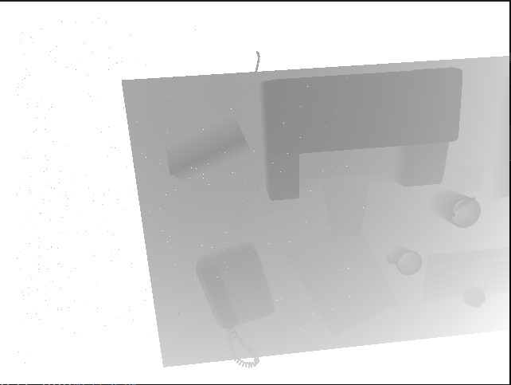
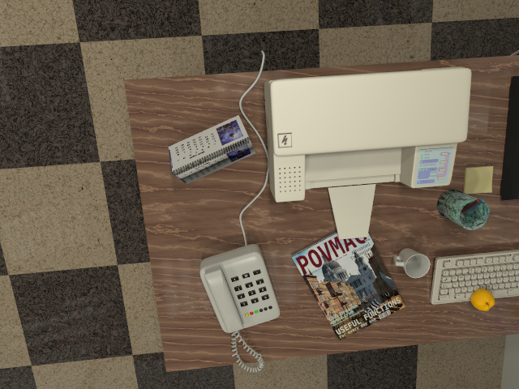

<div>
    <a href="./README.md">English</a>|
    <a href="./README.zh-CN.md">简体中文</a>
</div>

# <center>DenseMapping</center>

使用REMODE数据集进行单目相机的稠密建图。该项目会涉及以下技术

- 极线搜索和NCC块匹配技术
- 建立几何不确定性模型
- 基于高斯分布的深度滤波技术
- 三角测量技术

项目的技术路线图如下：

<div align="center">

</div>

## 1. 数据集格式解析

```shell
test_data
├── depthmaps                            # 图片深度信息文件夹
│   ├── scene_000.depth
│   ├── scene_001.depth
│   ├── scene_002.depth
│   ├── ...............
│   ├── scene_198.depth
│   ├── scene_199.depth
│   └── scene_200.depth
├── images_pose.txt                      # 存有所有图片的位姿信息
├── images                               # 图片文件夹
│   ├── scene_000.png
│   ├── scene_001.png
│   ├── scene_002.png
│   ├── .............
│   ├── scene_198.png
│   ├── scene_199.png
│   └── scene_200.png
└── README
```

<div align="center">
    
</div>

- 首先，感谢UZH开源的[REMODE数据集](https://download.ifi.uzh.ch/rpg/web/datasets/remode_test_data.zip)
- 在此项目中我将`first_200_frames_traj_over_table_input_sequence.txt`重命名为`images_pose.txt`
- `images_pose.txt`文件中的每行内容分别为 `图片文件名 tx ty tz qx qy qz qw`
- `images_pose.txt`文件存储着相机中心位置在世界坐标系中的位姿，`tx ty tz`中存储的单位为米
- `depthmaps`文件中存储的是对应图片中的深度信息，其单位为厘米
- 因此值得注意的是，在进行三角测量时，需要进行单位统一


## 2. 极线搜索和块匹配技术

<div align="center">

</div>

### 2.1 极线搜索法
$$
E = [t]_{×}R
$$

$$
F = K^{-T}EK^{-1}
$$

$$
l'=FX = [a', b', c']^T
$$

$$
l'X'= 0
$$
- $E$ 本质矩阵
- $F$ 基础矩阵
- $R$ 第二帧相机坐标系向第一帧相机坐标系的旋转矩阵
- $t$ 第二帧相机坐标系向第一帧相机坐标系的平移向量在第二帧中的坐标
- $[t]_{×}$ 平移向量的逆对称矩阵
- $l'$ 极线防方程的权重参数
- $X$ 第一帧像素坐标系中的其次坐标$[x, y, 1]$
- $X'$第二帧像素坐标系中的其次坐标$[x' y' 1]$

### 2.2 块匹配技术
- 与光流法和直接法不同，以像素块的灰度不变性作为假设
- 采用SVC，SSD或NCC作为评价像素块相似程度的指标（也可采用去均值的NCC，SVC，或SSD）
- SVC，SSD的值越小，相似度越高，NCC值越大，相似度越高
- 在极线上进行分块搜索，获取最优的像素深度的预测值（获取沿极线分布的评价相似性得分）

$$
S(A, B)_{SAD} = \sum_{i,j}|A(i, j) - B(i, j)|
$$

$$
S(A, B)_{SSD} = \sum_{i, j}(A(i, j) - B(i, j))^2
$$

$$
S(A, B)_{NCC} = \frac{\sum_{i, j}A(i, j)B(i,j)}{\sqrt{\sum_{i, j}A(i, j) ^ 2 \sum_{i, j}B(i, j) ^ 2}}
$$

## 3. 几何不确定性模型

<div align="center">

</div>

$$
\alpha = \arccos<\vec{p}, \vec{t}>
$$

$$
\beta' = \arccos<O_2p_2', -\vec{t}>
$$

$$
\gamma = \pi - \alpha - \beta'
$$

$$
||\vec{p'}|| = ||\vec{t}|| \frac{\sin\beta'}{\sin\gamma}
$$

$$
\sigma_{obs} = ||\vec{p}|| - ||\vec{p'}||
$$

- 向量$O_2p_2$与归一化坐标系上的向量$O_2P_2$在相机坐标系下的方向是一致的
- 可以使用向量$O_2P_2$代替向量$O_2p_2$对$\beta'$进行求解
- 值得注意的是，向量需要在世界坐标系中进行表示

## 4. 基于高斯分布的深度滤波器
基于高斯分布的深度滤波器的观测方程和预测方程如下：
$$
d_k = d_{k-1} +w_{k-1}
$$

$$
d_{k} = f(p_1, p_2, \vec{t}) + v_{k}
$$
- $w$ 为过程噪声，其满足正态分布$P(0, \sigma)$
- $v$ 为观测噪声，其满足正态分布$P(0, \sigma_{obs})$
- $p_1$ 为参照点
- $p_2$ 为重投影后的点
- $\vec{t}$ 为相机1到相机2的位姿平移量
 
对观测方程和预测方程进行融合可得最优后验估计如下：

$$
\hat d_{k} = \frac{\sigma_{obs}^2 d_{k-1} + \sigma ^2 f(p_1, p_2, \vec{t})}{\sigma_{obs}^2 +\sigma ^2}
$$

$$
\sigma_{fuse} = \frac{\sigma^2 \sigma_{obs}^2}{\sigma^2 + \sigma_{obs}^2}
$$


## 5. 项目依赖
- [Eigen 3.4 安装指南](https://gitlab.com/libeigen/eigen/-/releases/3.4.0)
- [OpenCV 4.7.0 安装指南](https://github.com/opencv/opencv/tree/4.7.0)
- [Sophus 1.22.10 安装指南](https://github.com/strasdat/Sophus/releases/tag/1.22.10)
- [PCL 1.13 安装指南](https://github.com/PointCloudLibrary/pcl/releases/tag/pcl-1.13.1)


## 6. 项目结构
```shell
DenseMapping
├── CMakeLists.txt
├── figures
│   ├── cpp_class_desc.png
│   ├── disturbance_analysis.png
│   ├── flow_chart.png
│   ├── polarSearch.png
│   ├── pose_data.png
│   ├── result_iter0.png
│   ├── result_iter1.png
│   ├── result_iter2.png
│   └── scene_000.png
├── include
│   ├── block_match.h                    # BlockMatch 类头文件
│   ├── config.h                         # 项目配置文件
│   ├── depth_filter.h                   # DepthFilter 类头文件
│   ├── polar_search.h                   # PolarSearch 类头文件
│   ├── read_dataset_files.h             # ReadDatasetFiles 类头文件
│   └── triangulation.h                  # Triangulation 类头文件
├── LICENSE
├── README.md
└── src
    ├── block_match.cpp                  # BlockMatch 类源文件
    ├── depth_filter.cpp                 # DepthFilter 类源文件
    ├── main.cpp
    ├── polar_search.cpp                 # PolarSearch 类源文件
    ├── read_dataset_files.cpp           # ReadDatasetFiles 类源文件
    └── triangulation.cpp                # Triangulation 类源文件
```

<div align="center">

</div>


## 7. 项目运行
```shell
mkdir build && mkdir result
cd build
cmake ..
cmake --build . --target dense_mapping
cd bin
./dense_mapping your_test_data_path
pcl_viewer ../../result/iter_0_result.pcd -ps 2.0
```

## 8. 运行结果
<table cellspacing="10" cellpadding="0" style="width: 100%; table-layout: fixed;">
  <tr>
    <td style="width: 25%;"></td>
    <td style="width: 25%;"></td>
  </tr>
  <tr>
    <td style="width: 25%;"></td>
    <td style="width: 25%;"></td>
  </tr>
  <tr>
    <td style="width: 25%;"></td>
    <td style="width: 25%;"></td>
  </tr>
</table>

## 9. 待优化部分

- 在块匹配部分，没有考虑相机的旋转带来仿射变换的影响
- 在深度滤波部分，深度并不符合高斯分布，需要更复杂的假设
- 在深度滤波部分，可以假设深度的倒数符合高斯分布，这是仿真得到的逆深度结论
- 相邻像素间的深度变化不能太大
- 没有显式的处理误匹配的情况
- 效率问题，没有采用并行化策略

## 10. 单目稠密建图缺陷

- 块匹配的准确程度取决于极线与图像梯度的夹角，夹角越小无匹配的可能性越小
